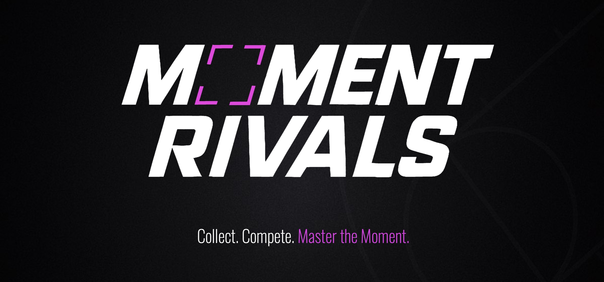

# Moment Rivals 

---

### 🏀 Overview 
**Moment Rivals** is a strategic basketball trading card game (TCG) built on Flow. Players compete using real NBA Top Shot Moments in fast-paced, head-to-head showdowns.

Each card is a Top Shot Moment reimagined for gameplay — transforming Flow’s largest on-chain asset into real-time strategy.

---

### 📦 Features (WIP)
- 🎴 Deck-building from your owned Top Shot Moments  
- ⚙️ Gear Cards to modify stats and add gameplay depth  
- 🔗 Flow wallet and Moment validation  
- ⛹️‍♂️ Real-time 4-quarter showdowns with bluffing & energy management  
- 💻 Web-based, mobile-optimized

---

### 📌 Current Status
- Finalizing core game logic and player turn structure  
- Begin frontend scaffolding + smart contracts  
- Developing a simple deck builder prototype  
- Publishing devlog + opening waitlist signups 

---

### 🗺️ Roadmap
A phased rollout designed to build from alpha to competitive ranked play:

- *Waitlist + Announcement*: Early access signup + teaser content  
- *Alpha Release*: Early gameplay begins with only Moments 
- *Beta Launch*: Testing gear system, player feedback loops  
- *Full Game Launch*: Gear Cards drop, leaderboard opens, S1 begins   
- *Ranked Mode*: Competitive ladders + rewards  
- *Gameplay Expansion*: Advanced mechanics + new game mode

---

### 🛠 Tech Stack
- Blockchain: **Flow**
- Frontend: **React**
- Contracts: **Cadence, Solidity** (*future eth collection integration*)

---

### 🗂 Repo Structure
<pre>
moment-rivals/  
├── frontend/              # Web client: Deck builder, UI, onboarding  
├── contracts/             # Smart contracts: Cadence / Solidity (EVM)  
├── docs/                  # Design docs, gameplay specs, diagrams  
├── assets/                # Game logos, card mockups, UI previews  
├── README.md              # Project intro, status, roadmap  
├── LICENSE                # MPL-2.0 License 
└── .gitignore
</pre>

---

### 📣 Community
- Twitter: [@MomentRivals](https://twitter.com/MomentRivals)  
- Grant Profile: [Flow GrantDAO on DoraHacks](https://dorahacks.io/flow/detail)  
- Pitch: [Moment Rivals - Pitch Deck](https://drive.google.com/file/d/1-ytuEJTA1PITX_1nPgMTKH6FecVqxggT/view?usp=share_link)  
- Website: [Launching Soon]() *(momentrivals.com)*

---

### 🧾 License
This project is open-source under the [MPL-2.0 License](https://www.mozilla.org/en-US/MPL/2.0/).  
*We welcome contributions and transparency while building a sustainable game economy.*